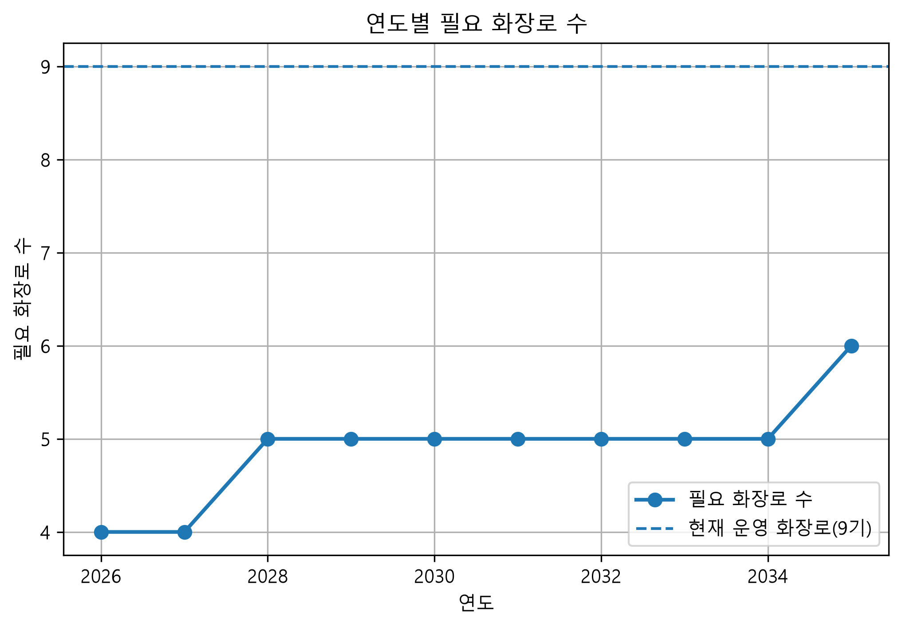

# 청주시 장사시설 화장 수요 예측 프로젝트

Python 기반 공공시설 수요예측 분석 프로젝트

## 1. 프로젝트 개요

본 프로젝트는 청주시 인구 변화와 화장 관련 지표를 활용하여
미래 화장 수요를 예측하고, 이를 기반으로 필요한 화장로 수를 산정하는
Python 기반 공공시설 수요예측 분석 프로젝트이다.

인구 감소 및 고령화에 따른 사망자 변화와 화장률 변화를 반영
하여 향후 장사시설 운영 및 공급 계획 수립을 위한 기초자료를 제공하는 것을 목표로 한다.


## 2. 프로젝트 목적

- 청주시 미래 인구 변화 추정
- 미래 사망자 수 예측
- 화장률 변화 분석
- 예상 화장 건수 산정
- 장사시설 수요 변화 파악
- 필요 화장로 수 산정
- 현재 시설 대비 추가 화장로 필요 여부 분석


## 3. 분석 프로세스

전체 분석 과정은 다음과 같다.

1. 인구 데이터 전처리
2. 미래 인구 예측
3. 조사망률 적용을 통한 예상 사망자 수 산정
4. 미래 화장률 예측
5. 예상 화장 건수 계산
6. 결과 분석 및 시각화
7. 필요 화장로 수 산정
8. 현재 시설 대비 추가 화장로 필요 여부 분석

## 4. 데이터

사용 데이터

| 데이터 | 내용 |
|---|---|
| 청주시 인구 데이터 | 연도별 인구 변화 |
| 화장률 데이터 | 연도별 화장률 |
| 조사망률 데이터 | 인구 대비 사망 수준 |


## 5. 분석 방법

### 인구 예측

Python의 Linear Regression을 활용하여 청주시 미래 인구를 추정하였다.


### 화장률 예측

과거 화장률 데이터를 기반으로 미래 화장률 변화를 예측하였다.


### 화장 수요 산정

예상 사망자 수와 예상 화장률을 활용하여 연도별 예상 화장 건수를 계산하였다.


### 화장로 수 산정

청주시 장사시설 수급계획의 운영 기준(화장로 1기당 연간 1,448건 처리)을
적용하여 연도별 필요 화장로 수를 산정하였다.

현재 운영 중인 화장로 수와 비교하여
추가 증설 필요 여부를 분석하였다.


## 6. 분석 결과

- 예측 기간은 **2026년부터 2035년**까지로 설정하였다.
- 예상 화장 수요는 **2026년 5,233건에서 2035년 7,541건으로 증가**하는 것으로 분석되었다.
- 예측 기간 전체 화장 수요는 **약 44.1% 증가**하는 것으로 나타났다.
- 이는 조사망률과 화장률 변화를 함께 반영한 결과이며, 향후 장사시설 공급 계획 수립을 위한 기초자료로 활용할 수 있다.
- 화장로 1기당 연간 처리능력(1,448건)을 기준으로 필요 화장로 수를 산정하였다.
- 분석 결과, 2035년까지 최대 필요 화장로 수는 6기로 나타났으며 현재 운영 중인 화장로(9기)로도 예측 수요를 충분히 처리할 수 있어 추가 증설은 필요하지 않은 것으로 분석되었다.

### 화장 수요 예측 결과


### 필요 화장로 수 산정




## 7. 분석의 한계

- 인구 예측은 선형회귀 모델을 적용하여 단순 추세를 반영하였다.
- 출산율, 인구 이동, 정책 변화 등 미래 인구에 영향을 미치는 다양한 요인은 반영하지 못하였다.
- 화장률 또한 과거 추세를 기반으로 예측하였으므로 실제 변화와 차이가 발생할 수 있다.


## 8. 프로젝트 구조

```
py_project
├── raw
├── data
├── processed
│   ├── population_processed.csv
│   ├── population_forecast.csv
│   ├── cremation_demand_forecast.csv
│   ├── cremation_analysis_result.csv
│   ├── facility_plan.csv
│   └── facility_plan.png
├── src
│   ├── 1_population_preprocessing.py
│   ├── 2_population_model.py
│   ├── 3_demand_estimation.py
│   ├── 4_result_analysis.py
│   └── 5_facility_planning.py
└── README.md
```


## 9. 향후 개선 방향

- ARIMA, Prophet 등 시계열 예측 모델 적용
- 통계청 장래인구추계를 활용한 인구 예측 정확도 향상
- 화장장 운영 시나리오(가동률·운영일수)별 분석 기능 추가
- 지역별 장사시설 수요 비교 분석