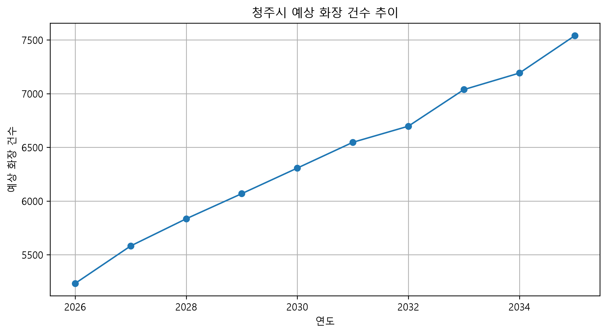

# 청주시 장사시설 수요예측 프로젝트

## 1. 프로젝트 목적

청주시 인구 변화와 사망 관련 지표를 활용하여
미래 화장 수요를 예측하고 장사시설 운영 수요를 추정하는 프로젝트이다.

## 2. 사용 데이터

### 인구 데이터
- 청주시 연도별 인구 데이터
- 미래 인구 예측 모델 생성

### 조사망률 데이터
- 청주시 인구 천 명당 조사망률
- 미래 사망자 수 추정에 활용

### 화장률 데이터
- 청주시 연도별 화장률
- 미래 화장률 예측에 활용

## 3. 분석 과정

1. 인구 데이터 전처리
2. 미래 인구 예측
3. 화장률 예측
4. 조사망률과 인구 데이터를 활용한 예상 사망자 계산
5. 화장률 적용을 통한 예상 화장 건수 산출

## 4. 분석 방법

### 인구 예측
- 선형회귀 모델 활용

### 화장률 예측
- 선형회귀 모델 활용
- 현실적 상한값(99%) 적용

## 5. 계산 방법

예상 사망자 수:

예측인구 × 조사망률 ÷ 1000

예상 화장 건수:

예상 사망자 수 × 화장률 ÷ 100

## 6. 결과

- 미래 연도별 예상 화장 건수 산출
- 결과 데이터 CSV 저장
- 수요 변화 그래프 생성

## 7. 한계점

- 화장률은 선형 추세를 기반으로 예측하였으며,
  장기적으로 현실적인 최대 수준을 고려하여 상한값을 적용하였다.
- 실제 수요는 정책 변화, 시설 이용 패턴 등에 영향을 받을 수 있다.
- 조사망률은 충청북도시군단위장래인구추계의 자료를 활용하였다.
- 실제 시설 계획에는 추가 변수 필요